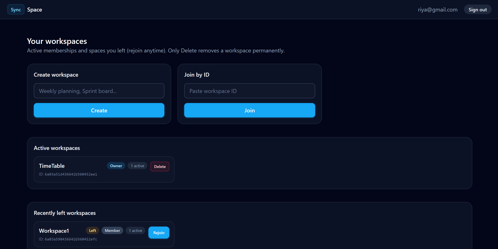

## CollabSpace

A real-time collaborative workspace platform where users can create shared workspaces, edit notes together, chat instantly, and see active collaborators.

## Live Demo

🌐 **Try CollabSpace here:** https://incandescent-fox-005f0f.netlify.app

### Screenshots

#### Dashboard :


#### Workspace :


### Stack

- **Frontend**: React (Vite, TypeScript), React Router, Axios, Socket.io client, TailwindCSS.
- **Backend**: Node.js, Express, Socket.io, MongoDB (Mongoose), JWT auth with bcrypt.
- **Production data**: [MongoDB Atlas](https://www.mongodb.com/atlas) or any MongoDB-compatible host (`MONGODB_URI`).

### Features

#### Authentication

- Register and log in using email and password.
- JWT-based authentication (token stored in `localStorage`, sent on REST requests via Axios).
- Protected frontend routes and backend `authMiddleware` on secured APIs.

#### Workspaces

- Create workspaces with **any non-empty title** after trim, up to **140 characters** (letters, numbers, spaces, symbols such as `_`, `-`, `&`, `#`, `+`, etc.).
- Join an existing workspace using its **workspace ID** (any authenticated user not already in `members` may join if they have the ID).
- Each workspace stores `title`, `createdBy`, active **`members`**, **`pastMembers`** (users who left voluntarily), and shared **`noteContent`**.
- **`GET /api/workspaces`** returns **`activeWorkspaces`** (you are in `members`) and **`recentWorkspaces`** (you are in `pastMembers` but not currently in `members`).
- **Owner** and **Member** badges on dashboard cards, plus **active member** counts.
- Workspaces you **leave** stay available under **Recently Left Workspaces** so you can **rejoin** without hunting the ID again (same join API).
- **Leaving never deletes** the workspace or messages. **Delete Workspace** (owner only) is the only action that permanently removes the workspace and chat history.

#### Dashboard

The dashboard includes:

- **Create Workspace** — controlled title input; new workspaces are merged into **Active Workspaces** immediately after a successful API response (no full-page refresh required). Background `GET /workspaces` refresh keeps lists in sync.
- **Join by Workspace ID**
- **Active Workspaces** — open a space in one click.
- **Recently Left Workspaces** — **Left** badge and **Rejoin**; owners can also **Delete** from here when applicable.

#### Workspace page (header actions)

| Role | Actions |
|------|---------|
| **Owner** | **Export Notes PDF**, **Leave Workspace**, **Delete Workspace** |
| **Member** | **Export Notes PDF**, **Leave Workspace** |

Leaving calls `POST /api/workspaces/:id/leave` (removed from `members`, added to `pastMembers`, socket room updated, `workspaceUpdated` emitted). If the owner leaves and others remain, **`ownershipTransferred`** is emitted and the next member becomes owner. If the owner is the last active member, the workspace **remains** (for rejoin or delete from the dashboard); it is **not** auto-deleted.

#### Real-time notes

- Shared collaborative notes (textarea) for everyone in the room.
- Debounced autosave to MongoDB (**~700 ms**) to limit writes.
- **`noteChange`** over Socket.io keeps collaborators in sync in real time.

#### Real-time chat

- Scrollable chat panel with a **fixed max height**; **auto-scroll** to the latest messages when the thread loads or new messages arrive.
- **Enter** sends a message; **Shift+Enter** inserts a new line.
- Dedicated **send** button in the composer; empty / whitespace-only sends are ignored.
- Messages are stored in MongoDB; live delivery uses Socket.io (**`message`** event) plus initial history via REST.
- If the socket is disconnected, send surfaces an error toast.

#### Active users & presence

- Live list of users connected to the current workspace.
- **`userConnected`** / **`userDisconnected`** keep the roster and counts up to date; lightweight toasts when others join or leave.

#### Role-based permissions (summary)

| Action | Owner | Member |
|--------|:-----:|:------:|
| Create workspace | Yes | Yes |
| Join workspace | Yes | Yes |
| Edit notes | Yes | Yes |
| Chat | Yes | Yes |
| Export notes PDF | Yes | Yes |
| Leave workspace | Yes | Yes |
| Remove other members | Yes | No |
| Delete workspace | Yes | No |
| Receive ownership when the owner leaves\* | Yes | Yes |

\*Applies to **remaining** members: one of them becomes the new owner when the previous owner leaves and at least one other member was still in the workspace.

#### Member removal (owner)

- In the **Active** sidebar, the owner sees **×** next to other members (not on the workspace owner row). Removal uses `DELETE /api/workspaces/:id/members/:memberId`, emits **`removedFromWorkspace`** to the kicked client, and **`workspaceUpdated`** for everyone else.

#### Export to PDF

- One-click **Export Notes PDF** from the workspace header.
- PDF includes workspace title, export timestamp, and the current shared notes body.

#### Real-time events (Socket.io)

| Event / flow | Purpose |
|----------------|---------|
| **`noteChange`** | Live shared notes updates between clients in the room. |
| **`sendMessage`** (client → server) / **`message`** (server → room) | Send and broadcast chat messages; server persists then emits. |
| **`userConnected`** | Presence refresh when someone joins the workspace room. |
| **`userDisconnected`** | Presence refresh when someone leaves or disconnects. |
| **`removedFromWorkspace`** | Targeted to a removed member; toast + redirect to dashboard. |
| **`workspaceDeleted`** | Workspace was permanently deleted; members toast + redirect. |
| **`ownershipTransferred`** | Owner left and another member became `createdBy`; toast + refetch. |
| **`workspaceUpdated`** | Member roster or metadata changed (join, leave, remove, rejoin); clients refetch workspace details. |

Additional client events: **`joinWorkspace`**, **`leaveWorkspace`** (socket lifecycle, not the same as the HTTP leave API name).

### Architecture

```text
Client (React + Socket.io)
        |
 REST API / WebSocket
        |
  Node.js + Express
        |
   MongoDB (Mongoose)
```

### Project structure

```text
collabspace/
├── backend
│   ├── src
│   │   ├── controllers
│   │   ├── models
│   │   ├── routes
│   │   ├── middleware
│   │   ├── socket
│   │   └── utils
│   └── package.json
│
├── frontend
│   ├── src
│   │   ├── pages
│   │   ├── components
│   │   ├── context
│   │   ├── services
│   │   ├── hooks
│   │   ├── layouts
│   │   └── types
│   └── package.json
│
└── README.md
```

### Environment variables

CollabSpace uses environment variables for backend configuration.

- Copy the example file to create your local config:

  ```bash
  cp .env.example backend/.env
  ```

- Then fill in:
  - **`MONGODB_URI`**: connection string for your MongoDB database.
  - **`JWT_SECRET`**: secret key used to sign authentication tokens.
  - **`CLIENT_ORIGIN`**: URL of the frontend (default `http://localhost:5173`).

After updating environment variables, restart the backend server.

### Deployment (production)

- **Frontend**: [Netlify](https://www.netlify.com/) — e.g. [https://incandescent-fox-005f0f.netlify.app](https://incandescent-fox-005f0f.netlify.app). The file **`frontend/public/_redirects`** sends all routes to `index.html` so **React Router** works on refresh and deep links.
- **Backend**: [Render](https://render.com/) (or similar Node host). Set **`CLIENT_ORIGIN`** to your **Netlify site origin** (same URL you open in the browser) so **CORS** and **Socket.io** work against the live frontend.
- **Database**: [MongoDB Atlas](https://www.mongodb.com/atlas) (or self-hosted MongoDB) via **`MONGODB_URI`**.

### Running locally

- **Backend**

  ```bash
  cd backend
  npm install
  npm run dev
  ```

- **Frontend**

  ```bash
  cd frontend
  npm install
  npm run dev
  ```

Open the frontend URL (default `http://localhost:5173`) in your browser, register a user, create a workspace, and start collaborating in real time.

### Future improvements

- Rich text editor for notes.
- Cursor presence indicators (like Google Docs).
- Finer role-based workspace permissions (owner, editor, viewer).
- File attachments and shared assets per workspace.
- **Workspace invitations by email** (magic links or invite flows).
- **Typing indicators** and **read receipts** in chat.
- Deployment with Docker and CI/CD pipeline.

---

## 👤 Author

Kratika Jasuja  
IIT Kharagpur
